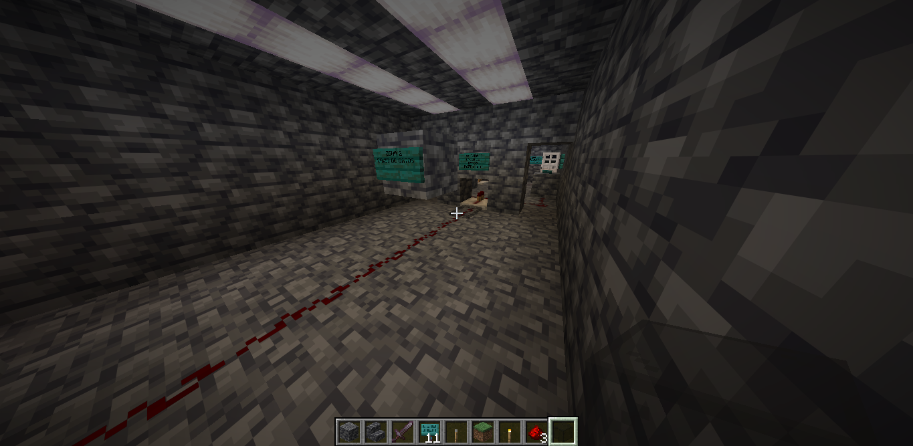
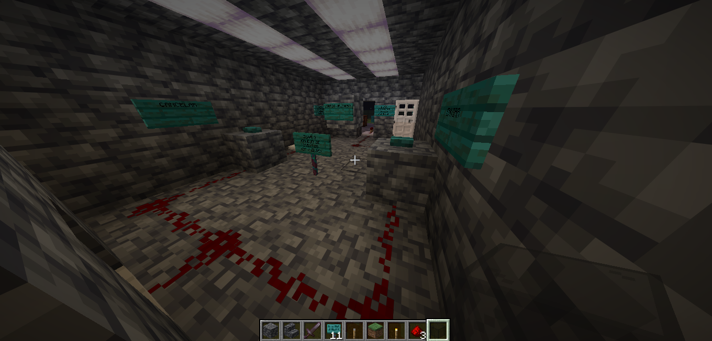
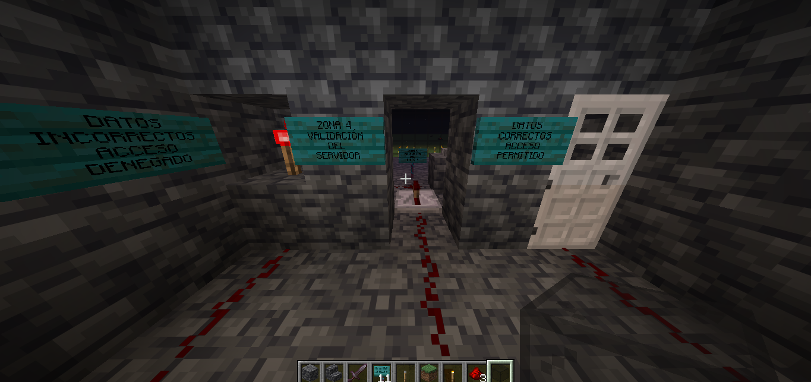
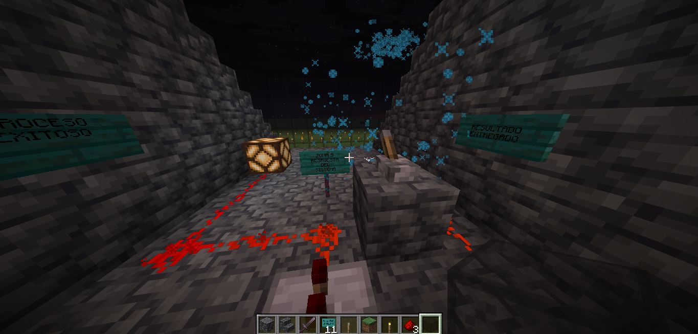

# Evidencia en Minecraft – Arquitectura / Patrones

## 1. Tema y subtema

**Tema:** Arquitectura de Software  
**Subtema:** Flujo de control y respuesta del sistema representado en Minecraft

---

## 2. Explicación del concepto

En programación, un sistema bien diseñado sigue un flujo claro: primero recibe
una entrada, después procesa esa información, toma una decisión y finalmente
genera una respuesta.

Este concepto es muy importante porque permite que los sistemas sean ordenados,
entendibles y fáciles de mantener. Cada parte del sistema tiene una función
específica y no todo ocurre al mismo tiempo ni sin control.

En Minecraft, este concepto se puede representar usando redstone, ya que los
componentes solo reaccionan cuando reciben una señal y ejecutan una acción
dependiendo de cómo esté construido el circuito.

---

## 3. Relación con la práctica en Minecraft

El mundo de Minecraft construido representa un sistema completo de software
dividido por zonas, donde cada zona cumple una función específica dentro del
flujo del sistema.

La redstone representa la lógica del programa, las palancas y botones son las
entradas de datos, los repetidores y comparadores simulan el procesamiento y
las decisiones, y los mecanismos finales representan la respuesta del sistema.

Todo el recorrido muestra cómo una acción inicial puede generar diferentes
resultados dependiendo de las condiciones, de forma muy similar a como funciona
un programa en la vida real.

---

## 4. Explicación por zonas del sistema

###  Zona 1: Entrada del sistema

Esta zona representa la entrada de datos del sistema. Aquí el usuario interactúa
con el sistema mediante un botón. Esta acción equivale a ingresar
información en un programa, como cuando un usuario presiona un botón en una
aplicación.

---

###  Zona 2: Procesamiento

En esta zona la señal de redstone comienza a procesarse. Se utilizan repetidores
para controlar el tiempo y la fuerza de la señal, representando cómo un sistema
procesa los datos antes de tomar una decisión.

---

### Zona 3: Decisión

Aquí el sistema decide qué camino seguir. La redstone se divide en dos salidas,
simulando una estructura condicional como un if/else en programación. Dependiendo
de la señal, el sistema continúa o se detiene.

---

### Zona 4: Control de acceso

Esta zona controla si el usuario puede avanzar o no. La puerta representa una
validación, similar a cuando un sistema permite o niega el acceso dependiendo
de una condición previa.

---

### Zona 5: Respuesta del sistema

En esta zona el sistema genera una respuesta visible. La lámpara encendida
representa que el proceso fue exitoso y el dispensador entrega un objeto como
resultado final. Esto simboliza cómo un sistema muestra resultados al usuario
después de ejecutar una acción correctamente.

---

## 5. Evidencia en video

Actualmente el video de evidencia aún  
En caso de incluirse, se proporcionará un enlace a Drive o YouTube (no listado)
con el recorrido completo del sistema.

---

## 6. Conclusión

Esta práctica demuestra cómo los conceptos de arquitectura y flujo de control
pueden representarse de manera visual e interactiva utilizando Minecraft. El
uso de redstone permite entender de forma clara cómo funcionan los sistema
reales en programación, desde la entrada de datos hasta la respuesta final.
